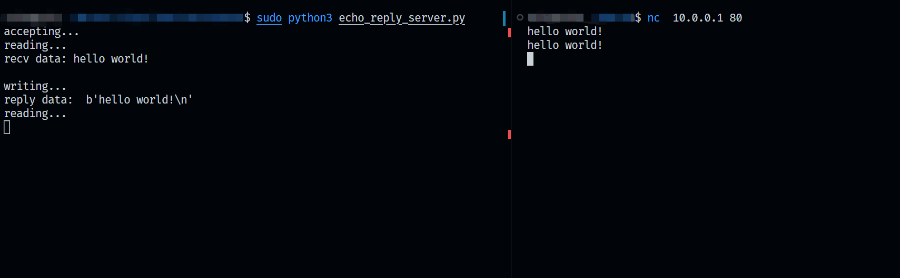

# teeceepee2

一个简单的TCP/IP协议栈实现🐌🐌🐌

## 为什么叫做teeceepee2?

名字受到 [teeceepee](https://github.com/jvns/teeceepee)的启发， Python背大锅🤣

## Usage

运行环境: python3.6+和一个linux发行版
在shell中启动teeceepee2服务：

```bash
sudo python3 ./echo_reply_server.py
```
你可以在另一个shell中和此服务通信：

#### 0. 拓扑

```txt
                +--------------------+
                |teeceepee2:         |
tap-veth0 ------|- veth0      veth1 -|----- tap-veth1
10.0.0.2        | 10.0.0.1  10.1.1.1 |       (none)
                +--------------------+
```

使用 `ip a` 可以看到虚拟接口：
        
```bash
$ip a
1: tap-veth0: <BROADCAST,UP,LOWER_UP> mtu 1500 qdisc fq_codel state UNKNOWN group default qlen 1000
    link/ether 4e:47:62:9f:88:28 brd ff:ff:ff:ff:ff:ff
    inet 10.0.0.2/24 brd 10.0.0.255 scope global tap-veth0
       valid_lft forever preferred_lft forever
    inet6 fe80::4c47:62ff:fe9f:8828/64 scope link 
       valid_lft forever preferred_lft forever
2: tap-veth1: <BROADCAST,UP,LOWER_UP> mtu 1500 qdisc fq_codel state UNKNOWN group default qlen 1000
    link/ether 3a:30:df:e0:a1:2f brd ff:ff:ff:ff:ff:ff
    inet6 fe80::3830:dfff:fee0:a12f/64 scope link 
       valid_lft forever preferred_lft forever
```

#### 1. ARP

使用 `arping` 可以发送ARP请求并接收ARP响应：

```bash
$sudo arping -I tap-veth0 10.0.0.1
ARPING 10.0.0.1
42 bytes from 4e:47:62:9f:88:28 (10.0.0.1): index=0 time=680.998 usec
42 bytes from 4e:47:62:9f:88:28 (10.0.0.1): index=1 time=706.467 usec
42 bytes from 4e:47:62:9f:88:28 (10.0.0.1): index=2 time=943.519 usec
42 bytes from 4e:47:62:9f:88:28 (10.0.0.1): index=3 time=1.034 msec
42 bytes from 4e:47:62:9f:88:28 (10.0.0.1): index=4 time=978.205 usec
^C
--- 10.0.0.1 statistics ---
5 packets transmitted, 5 packets received,   0% unanswered (0 extra)
rtt min/avg/max/std-dev = 0.681/0.869/1.034/0.146 ms
```


#### 2. ICMP

使用 `ping` 测试ICMP协议：

```bash
$ping -I 10.0.0.1
PING 10.0.0.2 (10.0.0.2) 56(84) bytes of data.
64 bytes from 10.0.0.2: icmp_seq=1 ttl=64 time=0.132 ms
64 bytes from 10.0.0.2: icmp_seq=2 ttl=64 time=0.085 ms
64 bytes from 10.0.0.2: icmp_seq=3 ttl=64 time=0.063 ms
64 bytes from 10.0.0.2: icmp_seq=4 ttl=64 time=0.085 ms
^C
--- 10.0.0.2 ping statistics ---
4 packets transmitted, 4 received, 0% packet loss, time 3124ms
rtt min/avg/max/mdev = 0.063/0.091/0.132/0.025 ms
```

#### 3. ROUTE

使用 `ip` 添加一个到10.1.1.0/24的路由, 然后就可以ping通在10.1.1.0/24网段的主机了：

```bash
$sudo ip route add 10.1.1.0/24 via 10.0.0.1 dev tap-veth0
$ping 10.1.1.1
PING 10.1.1.1 (10.1.1.1) 56(84) bytes of data.
64 bytes from 10.0.0.1: icmp_seq=1 ttl=64 time=0.531 ms
64 bytes from 10.0.0.1: icmp_seq=2 ttl=64 time=0.620 ms
64 bytes from 10.0.0.1: icmp_seq=3 ttl=64 time=1.09 ms
64 bytes from 10.0.0.1: icmp_seq=4 ttl=64 time=1.32 ms
^C
--- 10.1.1.1 ping statistics ---
4 packets transmitted, 4 received, 0% packet loss, time 3058ms
rtt min/avg/max/mdev = 0.531/0.890/1.322/0.327 ms
```

#### 4. TCP

使用 `nc` 连接到tcp服务器：

```bash
nc 10.0.0.1 80
```



Have fun!😆😆😆

## reference

[1] [level-ip](https://github.com/saminiir/level-ip)
[2] [tapip](https://github.com/chobits/tapip)
